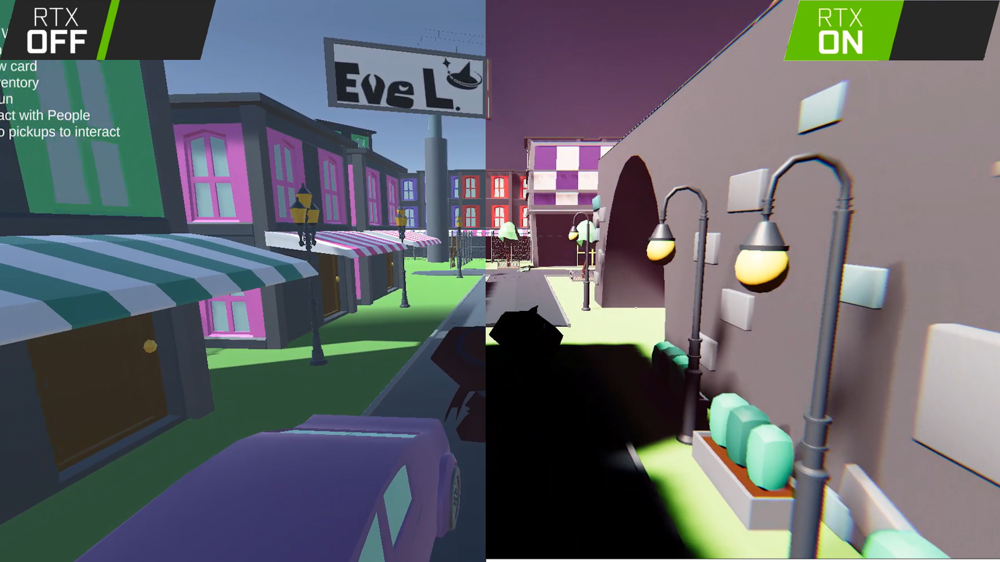

# Cardomancers

Video Game Studio Production class creates a game as a studio 



## Gameplay

You can checkout basic gameplay [here](https://www.youtube.com/watch?v=ddhOp5q5XeI).

## Testing the Game
To test out the game please check out one of the [releases](https://github.com/kchandle/VGSPSpring2026/releases) 

## Building
To build the unity project you may follow the steps below

### Clone the Repository
1. Clone the repository using your desired method
```
git clone https://github.com/kchandle/VGSPSpring2026.git
```

### Install The Correct Unity Editor

1. Download the unity hub if not already installed, [here](https://unity.com/).
2. Go through unity hub installer, open it and sign in.
3. Got to the Installs Page.
4. Click Install Editor
5. Go to this link [**Unity 6 6000.2.15f1**](https://unity.com/releases/editor/whats-new/6000.2.15f1#installs) and click Install

### Opening

1. Open the unity hub.
2. Goto the Projects tab
3. Click Add > Add project from disk.
4. Open the repository

## Management

| Role | Name | Contact |
| ---- | ------ | :-----: |
| Owner | [Kevin Chandlee](https://github.com/kchandle/)| [](https://github.com/kchandle/)  | 
| Game Design Director | [Indigo](https://github.com/overcastedSays/)| [](https://github.com/overcastedSays/)  | 
| Programming Director | [Himiki Sosa](https://github.com/Feild-Null/)| [](https://github.com/Feild-Null/)  | 
| Art Director | [Micah T.](https://github.com/MicahTArt/)| [](https://github.com/MicahTArt/)  | 

## Programmers

| Role | Name | Contact |
| ---- | ------ | :-----: |
| Pro Gamer | [Ash](https://github.com/AshKetchupGuy/)| [](https://github.com/AshKetchupGuy/)  | 
| SumGhost | [Vee](https://github.com/SumGhostDevelops/)| [](https://sumg..host/)  | 
| Bug Creator | [Ava](https://github.com/s1r3ns/)| [](https://github.com/s1r3ns/) [](https://discord.com/users/858519882035757066858519882035757066/)  | 
| Bug Solver | [Micah Hobbs](https://github.com/Hobbitcubed/)| [](https://github.com/Hobbitcubed/)  | 
| Infrastructure | [DerjenigeUberMensch](https://github.com/DerjenigeUberMensch/)| [](https://github.com/DerjenigeUberMensch/)  | 
| Coder | [Jackson Boyer](https://github.com/GingerBird777/)| [](https://github.com/GingerBird777/)  | 
| TNT | [Joshua](https://github.com/TNTM07/)| [](https://github.com/TNTM07/)  | 
| Person | [Jesse S.](https://github.com/N-cataria/)| [](https://github.com/N-cataria/)  | 
| Guy | [David](https://github.com/WallToast/)| [](https://github.com/WallToast/)  | 

## Art

| Role | Name | Contact |
| ---- | ------ | :-----: |
| Artist | Chloe Abrego| [](https://discord.com/users/913660359288700969/)  | 
| Artist | [Noah C.](https://github.com/DinoNuggies04/)| [](https://github.com/DinoNuggies04/) [](https://discord.com/users/722691375799205939/)  | 
| Artist | [Kennedi Porter](https://github.com/WheresMyPickles/)| [](https://github.com/WheresMyPickles/) [](https://discord.com/users/1219415965620502680/)  | 
| Artist | [Hunter](https://github.com/hunter0110huc/)| [](https://github.com/hunter0110huc/) [](https://discord.com/users/752577803731599400/)  | 
| Artist | Graeson Candanoza| [](https://discord.com/users/594738903425220608/)  | 
| Artist | [Rorik H.](https://github.com/Gajmi/)| [](https://github.com/Gajmi/)  | 
| Artist | Zachary G.| [](https://discord.com/users/761225884660793384/)  | 
| Artist | [Jonathan M.](https://github.com/jonathanm03167-hue/)| [](https://github.com/jonathanm03167-hue/) [](https://www.youtube.com/@STMM2008/)  | 
| Artist | Jackson Barlett| [](https://discord.com/users/837331314326765659/)  | 
| Artist | [Esteban Irizarry](https://github.com/SuperCoquiPR/)| [](https://github.com/SuperCoquiPR/)  | 
| Artist | [Jaedon Opalach](https://github.com/SwordCat1684/)| [](https://github.com/SwordCat1684/) [](https://discord.com/users/802306372531650570/)  | 

## Sound

| Role | Name | Contact |
| ---- | ------ | :-----: |
| Sound | [Max S.](https://github.com/kamijanitor/)| [](https://github.com/kamijanitor/)  | 

### Made In Part By All These People

<a href="https://github.com/kchandle/VGSPSpring2026/graphs/contributors">
  
</a>


